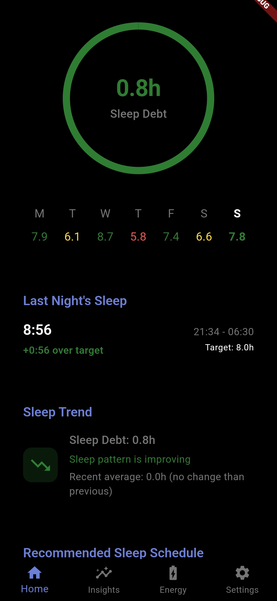
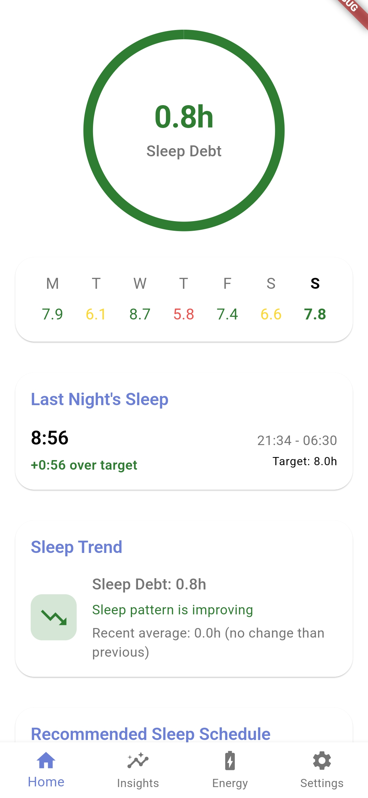

# Sleep Debt tracker

I made this app mostly to explore what is capable with the current LLM tools. I used [gptme](https://github.com/ErikBjare/gptme) check it out. Took about 4 hours of actual prompting + debugging + simulations, spent quite some time trying to make flutter_health_connect work.

The app was loosely inspired by the Rise Science sleep app.

Features planned:

- [x] Sleep debt tracking.
- [ ] Circardian style energy levels.
- [ ] Sleep Window + alarm management (partially done).
- [ ] Better UI styling.
- [ ] Much more lol.

The UI was mostly written by the LLMs so there might be quirks that don't exactly make sense, in the code at least. I spent a few minutes improving the sleep debt algorithm and running a few simulations (also written with gptme) which you can find in the simulations [directory](./simulations).

<div style="display: flex; justify-content: space-around;">
    
    
</div>

Note: that the time spend in bed, and the time actually spent asleep is different. Hence the different figures. The app is meant to be used with a smart watch, else it'll assume a 90% efficiency(typical).(Not yet implemented)

## Contributing

Clone by running the following command:

```bash
git clone --recurse-submodules https://github.com/brayo-pip/sleep_debt
```

if already cloned use

```bash
git submodules update --init 
```

Run `flutter run` to run the app. (will add releases later).
